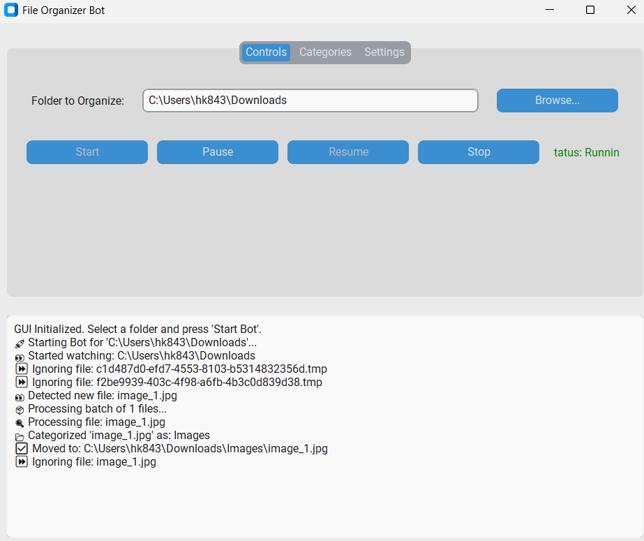
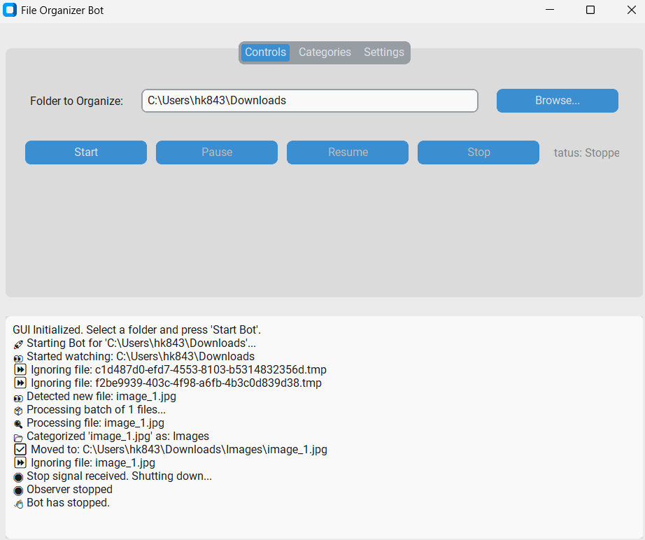

# File Organizer Bot with GUI

A Python-based application that automatically organizes files in a specified folder into categories. It features a full graphical user interface (GUI) for easy control and configuration.




---

## ✨ Features

* **Interactive GUI**: Control the bot with a user-friendly interface built with CustomTkinter.
* **Customizable Folder**: Choose any folder on your PC to organize.
* **Pause & Resume**: Start, pause, resume, and stop the organization process at any time.
* **Settings Tab**:
    * Switch between Light, Dark, and System appearance modes.
    * Specify a list of file extensions to exclude from organization.
* **Live Category Editor**: Edit the file categories directly within the app and apply changes without restarting.
* **Real-time Logging**: See what the bot is doing with a live log view in the app.
* **Log Rotation**: Log files are automatically managed to prevent them from becoming too large.

---

## 🚀 How to Run

### For Users

1.  **Clone the repository:**
    ```bash
    git clone [https://github.com/hk843/file-organizer-bot.git](https://github.com/hk843/file-organizer-bot.git)
    cd file-organizer-bot
    ```
2.  **Create and activate a virtual environment:**
    ```bash
    # For Windows
    python -m venv .venv
    .venv\Scripts\activate
    ```
3.  **Install the required dependencies:**
    ```bash
    pip install -r requirements.txt
    ```
4.  **Run the application:**
    ```bash
    python gui.py
    ```

### For Developers (Testing and Contributing)

If you want to run the tests or make changes to the code, you need to install the development dependencies.

1.  **Follow steps 1 and 2** from the "For Users" section.
2.  **Install all dependencies**, including testing libraries:
    ```bash
    pip install -r requirements-dev.txt
    ```
3.  **Run the test suite** to ensure everything is working correctly:
    ```bash
    pytest
    ```
4.  **Run the application:**
    ```bash
    python gui.py
    ```